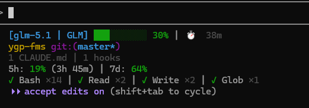

# Claude HUD GLM

**[English](#english) | [中文](#中文)**

---

<a id="中文"></a>

## 中文

> Fork 自 [Siiichenggg/claude-hud-glm](https://github.com/Siiichenggg/claude-hud-glm)

基于原版 claude-hud-glm 插件，增加了 **GLM Coding Plan 配额用量** 的实时显示。

[](LICENSE)
[](https://github.com/Siiichenggg/claude-hud-glm)

### 效果预览



状态栏会实时显示：
- **5h: 17% (3h 55m)** — 5小时滚动窗口 token 用量及重置倒计时
- **7d: 63%** — 每周 token 用量百分比

### 与原版的区别

| 特性 | 原版 | 本 Fork |
|------|------|---------|
| 用量数据来源 | Token 余额 API (`/api/biz/tokenAccounts/list/my`) | Coding Plan 配额 API (`/api/monitor/usage/quota/limit`) |
| 显示内容 | Token 包余额百分比 | 5小时窗口 + 每周额度用量 |
| 支持平台 | bigmodel.cn | bigmodel.cn + z.ai |
| 重置倒计时 | Token 过期时间 | 5小时窗口自动倒计时 |

### 安装

#### 方式一：直接替换已安装插件

如果你已经通过原版插件市场安装了 `claude-hud-glm`，可以直接替换编译后的文件：

```bash
# 替换缓存版本（实际运行的文件）
cp dist/glm-usage-api.js ~/.claude/plugins/cache/claude-hud-glm/claude-hud-glm/*/dist/glm-usage-api.js
cp dist/render/lines/usage.js ~/.claude/plugins/cache/claude-hud-glm/claude-hud-glm/*/dist/render/lines/usage.js
```

替换后重启 Claude Code 即可生效。

#### 方式二：从本仓库安装

```bash
git clone https://github.com/jinxiaocheng/claude-hud-glm.git
cd claude-hud-glm
npm install && npm run build
```

然后在 Claude Code 中：

```
/plugin marketplace add /path/to/claude-hud-glm
/plugin install claude-hud-glm
/claude-hud-glm:setup
```

### 配置要求

在 `~/.claude/settings.json` 中需要配置以下环境变量：

```json
{
  "env": {
    "ANTHROPIC_AUTH_TOKEN": "你的API密钥",
    "ANTHROPIC_BASE_URL": "https://api.z.ai/api/anthropic"
  }
}
```

支持的 BASE_URL：
- `https://api.z.ai/api/anthropic`
- `https://open.bigmodel.cn/api/anthropic`

### 工作原理

调用 GLM Coding Plan 的配额查询接口：

```
GET /api/monitor/usage/quota/limit
```

响应中的 `limits` 数组包含多个配额项，通过 `unit` 字段区分：

| unit | 含义 | 显示为 |
|------|------|--------|
| 3 | 5小时滚动窗口 token 用量 | `5h: XX%` |
| 6 | 每周 token 用量 | `7d: XX%` |
| 5 | MCP 工具月度用量 | （暂未显示） |

每个配额项还包含 `nextResetTime` 时间戳，用于计算重置倒计时。

### 技术细节

- **缓存机制**: 文件缓存，成功结果 60 秒过期，失败结果 15 秒过期
- **认证方式**: Authorization header 直接使用 API token（不加 Bearer 前缀）
- **颜色编码**: 百分比会根据用量自动变色（低 → 绿，中 → 黄，高 → 红）

### 致谢

- 原版插件: [Siiichenggg/claude-hud-glm](https://github.com/Siiichenggg/claude-hud-glm)
- 上游项目: [jarrodwatts/claude-hud](https://github.com/jarrodwatts/claude-hud)
- 配额 API 参考: [zai-org/zai-coding-plugins](https://github.com/zai-org/zai-coding-plugins)

---

<a id="english"></a>

## English

A Claude Code plugin that shows what's happening — context usage, active tools, running agents, todo progress, and **GLM Coding Plan quota tracking**. Always visible below your input.

This is a fork of [Siiichenggg/claude-hud-glm](https://github.com/Siiichenggg/claude-hud-glm) (which itself forks [jarrodwatts/claude-hud](https://github.com/jarrodwatts/claude-hud)) with support for **GLM Coding Plan** usage tracking.

[](LICENSE)
[](https://github.com/Siiichenggg/claude-hud-glm)

### What's Different

| Feature | Upstream | This Fork |
|---------|----------|-----------|
| Data source | Token balance API (`/api/biz/tokenAccounts/list/my`) | Coding Plan quota API (`/api/monitor/usage/quota/limit`) |
| Display | Token package balance % | 5-hour window + weekly quota usage |
| Platforms | bigmodel.cn | bigmodel.cn + z.ai |
| Reset countdown | Token expiry time | 5-hour window auto countdown |

### Install

**Option 1: Replace existing plugin files**

If you already installed `claude-hud-glm` from the marketplace:

```bash
cp dist/glm-usage-api.js ~/.claude/plugins/cache/claude-hud-glm/claude-hud-glm/*/dist/glm-usage-api.js
cp dist/render/lines/usage.js ~/.claude/plugins/cache/claude-hud-glm/claude-hud-glm/*/dist/render/lines/usage.js
```

Restart Claude Code after replacing.

**Option 2: Install from this repo**

```bash
git clone https://github.com/jinxiaocheng/claude-hud-glm.git
cd claude-hud-glm
npm install && npm run build
```

Then in Claude Code:

```
/plugin marketplace add /path/to/claude-hud-glm
/plugin install claude-hud-glm
/claude-hud-glm:setup
```

### Configuration

Add to `~/.claude/settings.json`:

```json
{
  "env": {
    "ANTHROPIC_AUTH_TOKEN": "your-api-key",
    "ANTHROPIC_BASE_URL": "https://api.z.ai/api/anthropic"
  }
}
```

Supported BASE_URL:
- `https://api.z.ai/api/anthropic`
- `https://open.bigmodel.cn/api/anthropic`

### How It Works

Calls the GLM Coding Plan quota API endpoint:

```
GET /api/monitor/usage/quota/limit
```

The `limits` array contains quota items distinguished by the `unit` field:

| unit | Meaning | Display |
|------|---------|---------|
| 3 | 5-hour rolling token window | `5h: XX%` |
| 6 | Weekly token quota | `7d: XX%` |
| 5 | Monthly MCP tool quota | (not shown yet) |

Each item includes a `nextResetTime` timestamp for countdown display.

### Technical Details

- **Caching**: File-based, 60s TTL for success, 15s for failures
- **Auth**: Raw token in Authorization header (no Bearer prefix)
- **Color coding**: Percentage auto-colors (green → yellow → red)

### Acknowledgments

- Original plugin: [Siiichenggg/claude-hud-glm](https://github.com/Siiichenggg/claude-hud-glm)
- Upstream project: [jarrodwatts/claude-hud](https://github.com/jarrodwatts/claude-hud)
- Quota API reference: [zai-org/zai-coding-plugins](https://github.com/zai-org/zai-coding-plugins)

## License

MIT License — see [LICENSE](LICENSE)
