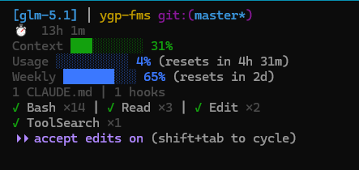

# Claude HUD GLM

**[English](#english) | [中文](#中文)**

---

<a id="中文"></a>

## 中文

> 基于 [jarrodwatts/claude-hud](https://github.com/jarrodwatts/claude-hud) 原版打补丁，添加 **GLM Coding Plan 配额用量** 实时显示。

[](LICENSE)
[](https://github.com/jarrodwatts/claude-hud)

### 效果预览



状态栏会实时显示：
- **Usage 3% (resets in 4h 34m)** — 5小时滚动窗口 token 用量及重置倒计时
- **Weekly 65% (resets in 2d)** — 每周 token 用量百分比

### 与原版的区别

仅修改了 2 个文件，其余全部使用原版 claude-hud 最新代码：

| 文件 | 改动内容 |
|------|----------|
| `dist/usage-api.js` | 新增 GLM Coding Plan 配额 API 调用（`/api/monitor/usage/quota/limit`） |
| `dist/index.js` | 新增回退逻辑：stdin 无 rate_limits 时调用 GLM 配额 API |

### 安装

#### 前置条件

1. 已安装 [Claude Code](https://docs.anthropic.com/en/docs/claude-code)
2. 已配置 GLM Coding Plan 的 API key

#### 步骤

**1. 安装原版 claude-hud**

在 Claude Code 中执行：
```
/plugin marketplace add jarrodwatts/claude-hud
/plugin install claude-hud
/claude-hud:setup
```

**2. 打 GLM 补丁**

```bash
git clone https://github.com/jinxiaocheng/claude-hud-glm.git
cd claude-hud-glm
chmod +x install.sh
./install.sh
```

**3. 配置 settings.json**

确保 `~/.claude/settings.json` 中有以下配置：

```json
{
  "env": {
    "ANTHROPIC_AUTH_TOKEN": "你的API密钥",
    "ANTHROPIC_BASE_URL": "https://api.z.ai/api/anthropic"
  }
}
```

支持的 BASE_URL：
- `https://api.z.ai/api/anthropic`
- `https://open.bigmodel.cn/api/anthropic`

重启 Claude Code 即可生效。

### 更新

当原版 claude-hud 更新后，补丁会被覆盖。重新运行安装脚本即可：

```bash
cd claude-hud-glm
./install.sh
```

### 配额 API 说明

调用 GLM Coding Plan 的配额查询接口：

```
GET /api/monitor/usage/quota/limit
```

响应中的 `limits` 数组包含多个配额项，通过 `unit` 字段区分：

| unit | 含义 | 显示为 |
|------|------|--------|
| 3 | 5小时滚动窗口 token 用量 | `Usage XX%` |
| 6 | 每周 token 用量 | `Weekly XX%` |
| 5 | MCP 工具月度用量 | （暂未显示） |

每个配额项还包含 `nextResetTime` 时间戳，用于计算重置倒计时。

### 技术细节

- **补丁方式**: 仅替换 2 个编译后的 JS 文件，不修改 TypeScript 源码
- **缓存机制**: 复用原版文件缓存（60s TTL 成功，15s TTL 失败）
- **认证方式**: Authorization header 直接使用 API token（不加 Bearer 前缀）
- **颜色编码**: 复用原版进度条和颜色系统（绿 → 黄 → 红）

### 致谢

- 原版 HUD: [jarrodwatts/claude-hud](https://github.com/jarrodwatts/claude-hud)
- 配额 API 参考: [zai-org/zai-coding-plugins](https://github.com/zai-org/zai-coding-plugins)

---

<a id="english"></a>

## English

A patch for [jarrodwatts/claude-hud](https://github.com/jarrodwatts/claude-hud) that adds **GLM Coding Plan quota tracking** to the HUD statusline.

[](LICENSE)
[](https://github.com/jarrodwatts/claude-hud)

### Preview


The statusline shows:
- **Usage 3% (resets in 4h 34m)** — 5-hour rolling token window with reset countdown
- **Weekly 65% (resets in 2d)** — Weekly token quota percentage

### What's Changed

Only 2 files are modified, everything else is the original claude-hud:

| File | Change |
|------|--------|
| `dist/usage-api.js` | Added GLM Coding Plan quota API call (`/api/monitor/usage/quota/limit`) |
| `dist/index.js` | Added fallback: calls GLM quota API when stdin lacks `rate_limits` |

### Install

#### Prerequisites

1. [Claude Code](https://docs.anthropic.com/en/docs/claude-code) installed
2. GLM Coding Plan API key configured

#### Steps

**1. Install original claude-hud**

In Claude Code:
```
/plugin marketplace add jarrodwatts/claude-hud
/plugin install claude-hud
/claude-hud:setup
```

**2. Apply GLM patch**

```bash
git clone https://github.com/jinxiaocheng/claude-hud-glm.git
cd claude-hud-glm
chmod +x install.sh
./install.sh
```

**3. Configure settings.json**

Ensure `~/.claude/settings.json` contains:

```json
{
  "env": {
    "ANTHROPIC_AUTH_TOKEN": "your-api-key",
    "ANTHROPIC_BASE_URL": "https://api.z.ai/api/anthropic"
  }
}
```

Supported BASE_URL:
- `https://api.z.ai/api/anthropic`
- `https://open.bigmodel.cn/api/anthropic`

Restart Claude Code to apply.

### Updating

When the original claude-hud updates, patches will be overwritten. Re-run:

```bash
cd claude-hud-glm
./install.sh
```

### Quota API

Calls the GLM Coding Plan quota endpoint:

```
GET /api/monitor/usage/quota/limit
```

The `limits` array contains quota items distinguished by the `unit` field:

| unit | Meaning | Display |
|------|---------|---------|
| 3 | 5-hour rolling token window | `Usage XX%` |
| 6 | Weekly token quota | `Weekly XX%` |
| 5 | Monthly MCP tool quota | (not shown yet) |

Each item includes a `nextResetTime` timestamp for countdown display.

### Technical Details

- **Patching**: Only replaces 2 compiled JS files, no TypeScript source changes
- **Caching**: Reuses original file cache (60s TTL success, 15s TTL failure)
- **Auth**: Raw token in Authorization header (no Bearer prefix)
- **Colors**: Reuses original progress bar and color system (green → yellow → red)

### Acknowledgments

- Original HUD: [jarrodwatts/claude-hud](https://github.com/jarrodwatts/claude-hud)
- Quota API reference: [zai-org/zai-coding-plugins](https://github.com/zai-org/zai-coding-plugins)

## License

MIT License — see [LICENSE](LICENSE)
